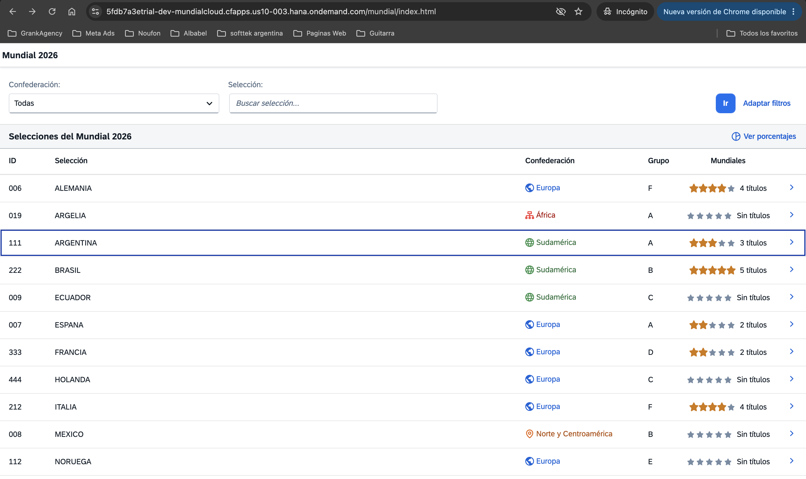
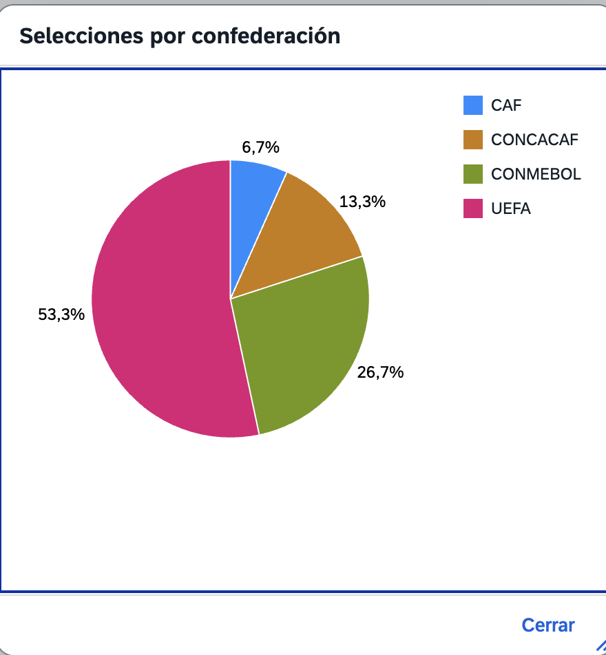
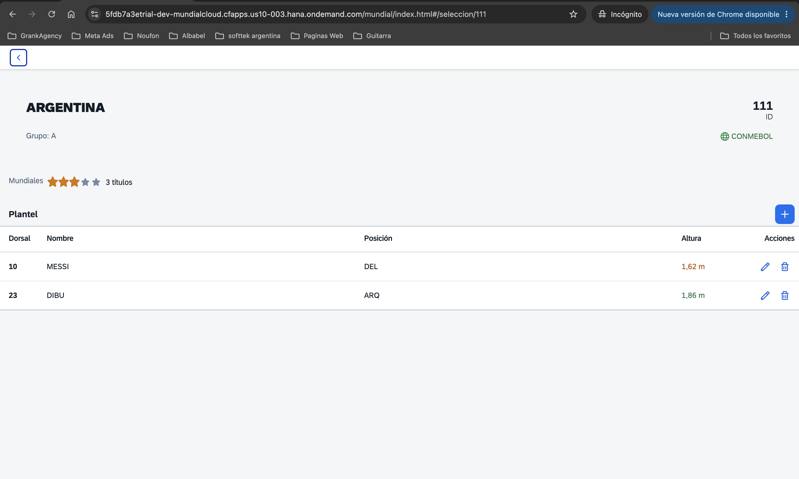
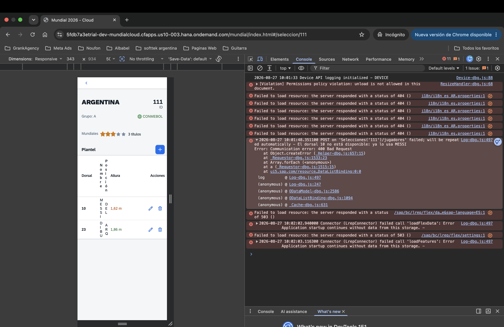
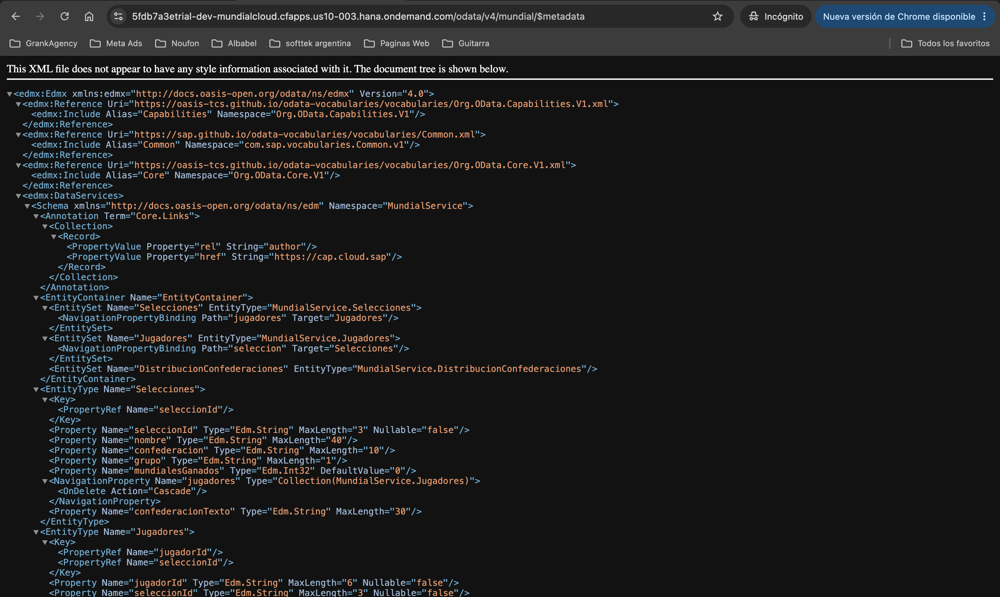
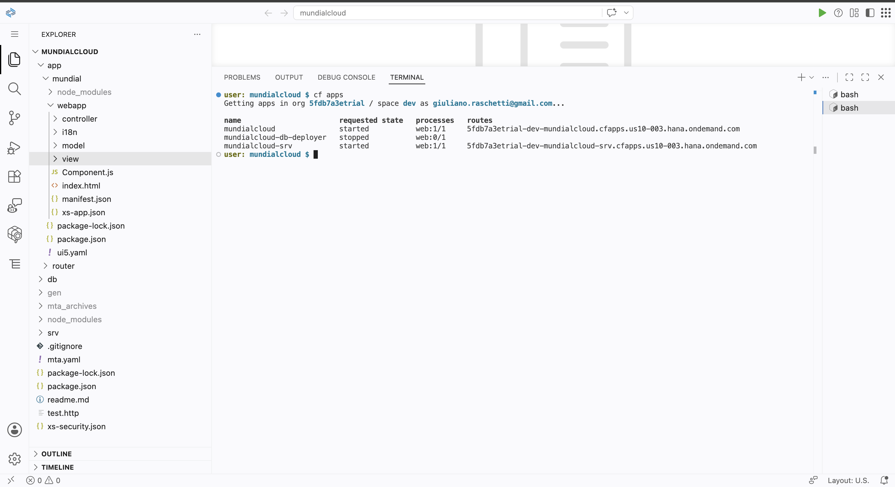

# Documento Técnico — Mundial 2026 Cloud

**Aplicación:** Mundial 2026 Cloud (SAP CAP + SAPUI5 sobre SAP BTP)
**Proyecto:** Capacitación y desarrollo SAP Full Stack
**Empresa:** Softtek Argentina
**Autor:** Giuliano Raschetti
**Mentor:** Jota Fontana
**Versión:** 1.0 · Agosto 2026

---

## Ficha técnica

| Campo | Valor |
|---|---|
| Nombre del sistema | Mundial 2026 Cloud |
| Repositorio | `https://github.com/giuliano1998/mundial-2026-cloud` |
| Rama principal | `main` |
| Entorno | SAP BTP — Cloud Foundry (cuenta trial) |
| Región / API endpoint | `https://api.cf.us10-003.hana.ondemand.com` |
| Org / Space | `5fdb7a3etrial` / `dev` |
| Stack backend | SAP CAP (Node.js) + SAP HANA Cloud |
| Stack frontend | SAPUI5 1.120 (freestyle, no Fiori Elements) |
| Protocolo | OData V4 |
| IDE | SAP Business Application Studio — Dev Space `mundialdev` |

### URLs productivas

| Recurso | URL |
|---|---|
| **Aplicación (App Router)** | `https://5fdb7a3etrial-dev-mundialcloud.cfapps.us10-003.hana.ondemand.com/mundial/index.html` |
| **Servicio OData V4** | `https://5fdb7a3etrial-dev-mundialcloud-srv.cfapps.us10-003.hana.ondemand.com/odata/v4/mundial/` |
| **Documento `$metadata`** | `.../odata/v4/mundial/$metadata` |

> El acceso a ambas URLs requiere autenticación con un usuario de la subcuenta BTP (XSUAA).

---

## 1. Objetivo y alcance

### Requerimiento

Construir una aplicación full-stack sobre SAP BTP para administrar las selecciones participantes del Mundial 2026 y sus planteles, con validaciones de negocio en el backend y una interfaz alineada a los lineamientos de SAP Fiori.

### Alcance funcional

| Función | Detalle |
|---|---|
| Consulta de selecciones | Listado con filtros por confederación y nombre |
| Detalle de selección | Datos de cabecera y plantel completo |
| ABM de jugadores | Alta, modificación y baja, con validación de dorsal único por selección |
| Análisis | Gráfico de distribución de selecciones por confederación |

### Contexto del proyecto

Este desarrollo es la **variante cloud** de un caso de uso implementado dos veces en paralelo. La variante on-premise (ABAP / SEGW / OData V2, servicio `ZGR_MUNDIAL_SRV`) está documentada por separado.

El objetivo pedagógico fue demostrar que **el frontend SAPUI5 es agnóstico al backend**: las mismas vistas XML sirven para las dos arquitecturas, y lo único que cambia sustancialmente es la capa de acceso a datos del controlador.

---

## 2. Arquitectura

```
                          INTERNET
                              │
                              ▼
        ┌─────────────────────────────────────────┐
        │   App Router (mundialcloud)             │
        │   - autentica contra XSUAA              │
        │   - rutea /odata/* al servicio CAP      │
        │   - sirve la UI desde HTML5 App Repo    │
        └─────────────────────────────────────────┘
              │                          │
              │ (estáticos)              │ (OData V4)
              ▼                          ▼
    ┌──────────────────────┐   ┌──────────────────────────┐
    │ HTML5 Application    │   │ CAP Service (Node.js)    │
    │ Repository           │   │ mundialcloud-srv         │
    │ - app "mundial"      │   │ - service.cds            │
    └──────────────────────┘   │ - service.js (handlers)  │
                               └──────────────────────────┘
                                           │
                                           ▼
                               ┌──────────────────────────┐
                               │ HDI Container            │
                               │ SAP HANA Cloud           │
                               │ (mundial-hana)           │
                               └──────────────────────────┘
```

### Servicios BTP utilizados

| Servicio | Plan | Función |
|---|---|---|
| `xsuaa` | application | Autenticación y autorización |
| `hana` | hdi-shared | Contenedor de base de datos |
| `html5-apps-repo` | app-host | Almacenamiento de la app UI5 |
| `html5-apps-repo` | app-runtime | Servicio de la app al usuario |
| `destination` | lite | Descubrimiento de la app |

---

## 3. Backend — Modelo de datos

**Archivo:** `db/schema.cds`

```cds
namespace mundial;

entity Selecciones {
  key seleccionId      : String(3);
      nombre           : String(40);
      confederacion    : String(10);
      grupo            : String(1);
      mundialesGanados : Integer default 0;
      jugadores        : Composition of many Jugadores
                           on jugadores.seleccionId = seleccionId;
}

entity Jugadores {
  key jugadorId   : String(6);
  key seleccionId : String(3);
      nombre      : String(40);
      posicion    : String(3);
      dorsal      : String(2);
      altura      : Decimal(3,2);
      seleccion   : Association to Selecciones
                      on seleccion.seleccionId = seleccionId;
}
```

### Tablas generadas en HANA

| Entidad CDS | Tabla física |
|---|---|
| `mundial.Selecciones` | `mundial_Selecciones` |
| `mundial.Jugadores` | `mundial_Jugadores` |

### Relación y cardinalidad

**`Selecciones` → `Jugadores` (1:N, Composición).** Relación padre-hijo con dependencia de existencia: al eliminar una selección se eliminan en cascada sus jugadores. CAP genera automáticamente el `OnDelete Cascade` en el `$metadata` a partir del `Composition of many`.

**`Jugadores` → `Selecciones` (N:1, Asociación).** Cada jugador pertenece a una única selección.

### ⚠ Clave compuesta en Jugadores

`Jugadores` tiene **clave compuesta** (`jugadorId` + `seleccionId`). Consecuencia directa: **toda URL OData de un jugador lleva las dos partes**.

```
GET    /Jugadores(jugadorId='000004',seleccionId='111')
PATCH  /Jugadores(jugadorId='000004',seleccionId='111')
DELETE /Jugadores(jugadorId='000004',seleccionId='111')
```

Es el punto que más confunde a quien toma el desarrollo por primera vez.

### Tipos de dato — decisiones

| Campo | Tipo | Motivo |
|---|---|---|
| `mundialesGanados` | `Integer` | permite ordenar y filtrar numéricamente; se bindea directo al `RatingIndicator` |
| `altura` | `Decimal(3,2)` | precisión exacta en base 10 (`1.85`). Nunca `Double` para medidas |
| `dorsal` | `String(2)` | se normaliza con ceros a izquierda (`"07"`) para que el orden alfabético coincida con el numérico |
| `jugadorId` | `String(6)` | equivalente al `NUMC(6)` del track on-premise |

### Datos maestros

Los datos de prueba se cargan desde archivos CSV en `db/data/`:

```
db/data/mundial-Selecciones.csv     15 selecciones
db/data/mundial-Jugadores.csv       11 jugadores
```

**Convención obligatoria:** `<namespace>-<Entidad>.csv`, separador `;`, primera fila con los nombres de los elementos CDS exactos y sensibles a mayúsculas. Si el nombre no coincide, **CAP ignora el archivo en silencio** y la tabla queda vacía sin error.

En el despliegue productivo, el módulo `mundialcloud-db-deployer` traduce estos CSV a artefactos `.hdbtabledata` y los carga en HANA.

---

## 4. Backend — Servicio OData V4

**Archivos:** `srv/service.cds` (definición) y `srv/service.js` (lógica)

### Endpoint

```
/odata/v4/mundial/
```

### Definición del servicio

```cds
using mundial from '../db/schema';

service MundialService {

  @cds.redirection.target: true
  entity Selecciones as projection on mundial.Selecciones {
    *,
    virtual null as confederacionTexto : String(30)
  };

  entity Jugadores as projection on mundial.Jugadores;

  @readonly
  @cds.redirection.target: false
  entity DistribucionConfederaciones as
    select from mundial.Selecciones {
      key confederacion,
          count(*) as cantidad : Integer
    }
    group by confederacion;
}
```

### Entidades expuestas

| Entidad | Operaciones | Propósito |
|---|---|---|
| **`Selecciones`** | READ | Listado y detalle de selecciones. Incluye el campo virtual `confederacionTexto` |
| **`Jugadores`** | READ, CREATE, UPDATE, DELETE | ABM del plantel |
| **`DistribucionConfederaciones`** | READ (solo lectura) | Vista agregada: cantidad de selecciones por confederación |

### Ejemplos de invocación

```http
### Listado de selecciones
GET /odata/v4/mundial/Selecciones?$select=nombre,confederacion,mundialesGanados

### Selección con su plantel
GET /odata/v4/mundial/Selecciones('111')?$expand=jugadores

### Filtro combinado
GET /odata/v4/mundial/Selecciones?$filter=confederacion eq 'CONMEBOL' and contains(nombre,'ARG')

### Distribución por confederación
GET /odata/v4/mundial/DistribucionConfederaciones

### Alta de jugador
POST /odata/v4/mundial/Jugadores
Content-Type: application/json

{ "seleccionId": "111", "nombre": "MESSI", "posicion": "DEL", "dorsal": "10" }
```

> **El servicio OData es independiente del frontend.** En este proyecto lo consume una app SAPUI5, pero podría consumirlo cualquier cliente HTTP: una aplicación React, un servicio de integración, o Postman.

### Anotaciones de redirección

`@cds.redirection.target` es necesario porque **dos entidades del servicio proyectan sobre la misma tabla** (`Selecciones` y `DistribucionConfederaciones`). Sin estas anotaciones, el compilador de CDS no puede resolver a cuál redirigir la asociación `seleccion` de `Jugadores` y falla con `redirected-implicitly-ambiguous`.

---

## 5. Backend — Lógica de negocio

**Archivo:** `srv/service.js`

CAP genera el CRUD completo sin necesidad de escribir código. La lógica propia se implementa mediante **hooks** sobre el ciclo de vida de cada operación:

```
petición → before → on → after → respuesta
             │      │      │
        validar   reemplazar   transformar
                  la impl.     el resultado
```

### 5.1 Transformación de salida — `after READ` sobre `Selecciones`

Traduce el código técnico de confederación a un texto de negocio (`UEFA` → `Europa`).

```js
this.after('READ', Selecciones, (data) => {
    const filas = Array.isArray(data) ? data : [data];
    filas.forEach((fila) => {
        if (fila && fila.confederacion) {
            fila.confederacionTexto = CONFEDERACIONES[fila.confederacion]
                                   || fila.confederacion;
        }
    });
});
```

**Decisión de diseño:** se rellena el campo virtual `confederacionTexto` en lugar de sobrescribir `confederacion`. El valor técnico debe permanecer intacto porque **el `$filter` se resuelve en la base de datos, antes de que el handler `after` se ejecute**. Sobrescribir el campo rompería el filtrado.

El frontend muestra `confederacionTexto` y filtra por `confederacion`, del mismo modo que un control de selección distingue entre `key` y `text`.

### 5.2 Validación de unicidad — `before CREATE` sobre `Jugadores`

```js
if (datos.dorsal) {
    const ocupado = await SELECT.one.from(Jugadores)
        .where({ seleccionId: datos.seleccionId, dorsal: datos.dorsal });

    if (ocupado) {
        return req.error(400,
            `El dorsal ${datos.dorsal} no está disponible: ya lo usa ${ocupado.nombre}`,
            'dorsal');
    }
}
```

La restricción es sobre la **combinación** `(seleccionId, dorsal)`: el dorsal 10 puede existir simultáneamente en Argentina y en Brasil.

El tercer argumento de `req.error()` identifica el campo afectado; SAPUI5 lo utiliza para resaltar el control correspondiente en el formulario.

### 5.3 Validación en modificación — `before UPDATE` sobre `Jugadores`

```js
const claves = req.params[req.params.length - 1];

const ocupado = await SELECT.one.from(Jugadores)
    .where({ seleccionId: claves.seleccionId, dorsal: req.data.dorsal });

if (ocupado && ocupado.jugadorId !== claves.jugadorId) {
    return req.error(400, `El dorsal ${req.data.dorsal} no está disponible...`, 'dorsal');
}
```

**La comparación `ocupado.jugadorId !== claves.jugadorId` es obligatoria.** Sin ella, modificar un jugador sin cambiar su dorsal falla, porque el registro se encuentra a sí mismo en la consulta.

### 5.4 Generación de identificadores — `before CREATE`

```js
const fila = await SELECT.one.from(Jugadores).columns('max(jugadorId) as maxId');
const siguiente = Number(fila?.maxId || 0) + 1;
datos.jugadorId = String(siguiente).padStart(6, '0');
```

Reproduce el patrón `SELECT MAX( )` del track on-premise. El relleno con ceros se hace explícitamente, a diferencia de ABAP donde el tipo `NUMC` lo aplica de forma automática.

---

## 6. Frontend — SAPUI5

### Estructura del proyecto

```
app/mundial/
├── webapp/
│   ├── controller/
│   │   ├── Selecciones.controller.js
│   │   └── Detalle.controller.js
│   ├── i18n/
│   │   ├── i18n.properties          (es, por defecto)
│   │   └── i18n_en.properties       (en)
│   ├── model/
│   │   └── formatter.js
│   ├── view/
│   │   ├── App.view.xml
│   │   ├── Selecciones.view.xml
│   │   ├── Detalle.view.xml
│   │   ├── JugadorDialog.fragment.xml
│   │   └── GraficoDialog.fragment.xml
│   ├── Component.js
│   ├── index.html
│   ├── manifest.json
│   └── xs-app.json
├── package.json
└── ui5.yaml
```

> Aplicación **freestyle**: las vistas están escritas a mano, no generadas con Fiori Elements. Esto permitió controlar cada control y su binding de forma explícita.

### Vistas y componentes

| Archivo | Función |
|---|---|
| `App.view.xml` | Contenedor raíz (`App` con la aggregation `pages`) |
| `Selecciones.view.xml` | Listado con FilterBar, tabla y botón de análisis |
| `Detalle.view.xml` | Cabecera de la selección y tabla del plantel |
| `JugadorDialog.fragment.xml` | Diálogo de alta y modificación de jugadores |
| `GraficoDialog.fragment.xml` | Diálogo con el gráfico de torta (`sap.viz`, `vizType="pie"`) |

### Controles destacados

| Control | Uso |
|---|---|
| `sap.ui.comp.filterbar.FilterBar` | Filtros por confederación (`Select`) y nombre (`Input`) |
| `sap.m.ObjectStatus` | Confederación y altura, con color e ícono según valor |
| `sap.m.RatingIndicator` | Mundiales ganados, con `maxValue="5"` |
| `sap.viz.ui5.controls.VizFrame` | Gráfico de torta con porcentajes |
| `sap.m.Dialog` | Diálogos de jugador y gráfico, cargados como Fragment |

### Filtrado — decisión de performance

El FilterBar acumula los criterios y ejecuta **una sola consulta al backend** al presionar el botón "Ir".

```js
onBuscar: function () {
    var aFilters = [];
    var sConfederacion = this.byId("filtroConfederacion").getSelectedKey();
    var sNombre        = this.byId("filtroNombre").getValue();

    if (sConfederacion) {
        aFilters.push(new Filter("confederacion", FilterOperator.EQ, sConfederacion));
    }
    if (sNombre) {
        aFilters.push(new Filter("nombre", FilterOperator.Contains, sNombre.toUpperCase()));
    }

    this.byId("tablaSelecciones").getBinding("items").filter(aFilters);
}
```

Se descartó el enfoque de búsqueda incremental (`liveChange`), que genera una petición por cada tecla pulsada. Con volúmenes de decenas de miles de registros ese patrón resulta inviable.

El filtro se resuelve **en la base de datos**, no en el cliente:

```
$filter=confederacion eq 'CONMEBOL' and contains(nombre,'ARG')
```

### Formateadores

**Archivo:** `model/formatter.js`

| Función | Entrada → Salida |
|---|---|
| `alturaTexto` | `1.86` → `"1,86 m"` |
| `alturaEstado` | altura → `Success` / `Warning` / `None` |
| `confederacionEstado` | `UEFA` → `Information` |
| `confederacionIcono` | `UEFA` → `sap-icon://globe` |
| `mundialesTexto` | `3` → `"3 títulos"` · `1` → `"1 título"` · `0` → `"Sin títulos"` |

⚠ **Nota de implementación:** el modelo OData V4 formatea los `Edm.Decimal` según el locale del usuario **antes** de pasarlos al formateador. Con locale español, la altura llega como la cadena `"1,86"` (coma decimal), no como número. Todos los formateadores de altura normalizan con `Number(String(v).replace(",", "."))`.

### Internacionalización

Todos los textos de la interfaz están externalizados en `i18n/i18n.properties` (español, por defecto) e `i18n_en.properties` (inglés). No hay literales embebidos en las vistas.

### Navegación

Configurada en `manifest.json` con `sap.m.routing.Router`:

| Ruta | Patrón | Destino |
|---|---|---|
| `RouteSelecciones` | `""` | `Selecciones` |
| `RouteDetalle` | `seleccion/{seleccionId}` | `Detalle` |

Patrón master-detail. El detalle soporta acceso directo por URL (deep link).

### Configuración del modelo OData

```json
"": {
  "dataSource": "mainService",
  "settings": {
    "operationMode": "Server",
    "autoExpandSelect": true,
    "earlyRequests": true,
    "groupId": "$auto",
    "updateGroupId": "$auto"
  }
}
```

`autoExpandSelect: true` hace que UI5 construya el `$select` a partir de los campos efectivamente enlazados en las vistas, reduciendo el volumen de datos transferido.

---

## 7. Despliegue

### Módulos del MTA

**Archivo:** `mta.yaml`

| Módulo | Tipo | Función |
|---|---|---|
| `mundialcloud-srv` | `nodejs` | Servicio CAP. Proceso permanente |
| `mundialcloud-db-deployer` | `hdb` | Crea tablas y carga los CSV. Ejecución única |
| `mundial-ui` | `html5` | Compila la app UI5 y genera `mundial.zip` |
| `mundialcloud-app-deployer` | `com.sap.application.content` | Sube el zip al HTML5 Repository. Ejecución única |
| `mundialcloud` | `approuter.nodejs` | App Router. Proceso permanente |

El despliegue es **transaccional**: si un módulo falla, se revierte la operación completa.

### Procedimiento

```bash
# 1. Autenticación
cf login -a https://api.cf.us10-003.hana.ondemand.com

# 2. Construcción del archivo MTA
mbt build

# 3. Despliegue
cf deploy mta_archives/mundialcloud_1.0.0.mtar
```

**Requisito previo:** la instancia de SAP HANA Cloud (`mundial-hana`) debe estar en estado *Running*. En cuentas trial se detiene automáticamente por inactividad.

### Verificación

```bash
cf apps                                          # estado de las aplicaciones
cf html5-list                                    # apps en el HTML5 Repository
cf logs mundialcloud --recent                    # trazas del App Router
cf logs mundialcloud-srv --recent                # trazas del servicio CAP
```

### HTML5 Application Repository

La aplicación UI5 no se sirve desde el disco del App Router, sino desde el **HTML5 Application Repository**. Esta arquitectura es el prerrequisito para publicar la aplicación en un launchpad corporativo.

⚠ **Punto crítico de configuración:** cada aplicación alojada en el repositorio requiere **su propio `xs-app.json` incluido dentro del paquete**, en `app/mundial/webapp/xs-app.json`. El `xs-app.json` del App Router no es suficiente: cuando el App Router sirve contenido desde el repositorio, tanto los archivos estáticos como las reglas de ruteo se recuperan desde allí.

| Archivo | Lo consume | Función |
|---|---|---|
| `app/router/xs-app.json` | App Router | Rutea `/odata/*` al backend; el resto al repositorio |
| `app/mundial/webapp/xs-app.json` | HTML5 App Runtime | Ruteo interno de la aplicación |

---

## 8. Entorno de desarrollo

### Ejecución local

```bash
cds watch
```

Levanta el servicio en `http://localhost:4004` con base SQLite en memoria y autenticación simulada. Los CSV se recargan en cada reinicio.

### Pruebas del servicio

El archivo `test.http` contiene peticiones de prueba ejecutables desde la extensión REST Client de BAS, incluyendo los casos de validación de dorsal duplicado.

### Diferencias entre entornos

| Aspecto | Local (`cds watch`) | Productivo (BTP) |
|---|---|---|
| Base de datos | SQLite en memoria | SAP HANA Cloud |
| Autenticación | simulada (`mocked`) | XSUAA |
| Datos | recarga desde CSV en cada arranque | persistentes |
| Comparación de texto | `LIKE` insensible a mayúsculas | `LIKE` sensible a mayúsculas |

⚠ La última fila es relevante: una consulta con `contains()` en minúsculas funciona en local y no devuelve resultados en HANA. Por este motivo el filtro por nombre aplica `toUpperCase()` antes de enviar la consulta.

---

## 9. Control de versiones

**Repositorio:** `https://github.com/giuliano1998/mundial-2026-cloud`

| Rama | Contenido |
|---|---|
| `main` | Versión estable, sirve la app desde el HTML5 Repository |
| `feature/work-zone` | Rama de trabajo de la migración al repositorio |

**Excluidos del control de versiones** (`.gitignore`): `node_modules/`, `gen/`, `mta_archives/`, `app/mundial/dist/`, `resources/`, `default-*.json`, `*.sqlite`.

> `default-env.json` se excluye explícitamente porque puede contener credenciales de servicios de BTP.

---

## 10. Estado y pendientes

### Implementado

- Modelo de datos y servicio OData V4 con tres entidades expuestas
- CRUD completo de jugadores con validaciones de negocio en el backend
- Interfaz SAPUI5 con filtrado en servidor, formateadores y visualización analítica
- Despliegue en SAP BTP con los cinco módulos operativos
- Aplicación servida desde el HTML5 Application Repository

### Pendiente

| Punto | Detalle |
|---|---|
| **Publicación en launchpad** | Requiere migrar a *managed approuter* y disponer de un tenant de SAP Cloud Identity Services (IAS) con confianza OIDC. La cuenta trial no cumple estos requisitos. Previsto en la subcuenta corporativa de Softtek |
| **Autorizaciones por rol** | El `xs-security.json` no define scopes propios: cualquier usuario autenticado accede a todo. La implementación se realiza con anotaciones `@restrict` sobre el modelo CDS |

### Deuda técnica identificada

| Punto | Situación actual | Recomendación |
|---|---|---|
| Generación de `jugadorId` | `SELECT MAX( ) + 1` | UUID o secuencia. El patrón actual no soporta concurrencia y reutiliza identificadores tras un borrado |
| Unicidad de dorsal | validación en el handler | añadir restricción `UNIQUE(seleccionId, dorsal)` en la base. El handler presenta una ventana de condición de carrera |
| Filtro por nombre | `toUpperCase()` en el cliente | normalizar en el backend o emplear `tolower()` en el filtro |
| Textos de confederación | duplicados en `service.js` y `formatter.js` | entidad de textos con anotación `localized` |
| Gráfico de distribución | agrega sobre el total | propagar los filtros activos al binding del gráfico, si se requiere consistencia con la tabla |

---

## Anexo — Capturas

> Las imágenes se ubican en `docs/img/` dentro del repositorio.

### Figura 1 — Listado de selecciones



*Vista principal: FilterBar, confederaciones con ícono y color, mundiales ganados como valoración.*

### Figura 2 — Distribución por confederación



*Gráfico de torta con porcentajes. La agregación se resuelve en la base mediante `GROUP BY`.*

### Figura 3 — Detalle de selección y plantel



*Cabecera de la selección y tabla de jugadores con alturas formateadas y coloreadas.*

### Figura 4 — Validación de negocio



*Mensaje de error generado por el handler `before CREATE` al intentar asignar un dorsal ya ocupado.*

### Figura 5 — Documento `$metadata`



*Contrato del servicio OData V4 con las tres entidades expuestas.*

### Figura 6 — Aplicaciones desplegadas



*Resultado de `cf apps`: App Router y servicio CAP en ejecución; los módulos de despliegue finalizados.*

---

**Documento generado en agosto de 2026 · Versión 1.0**
